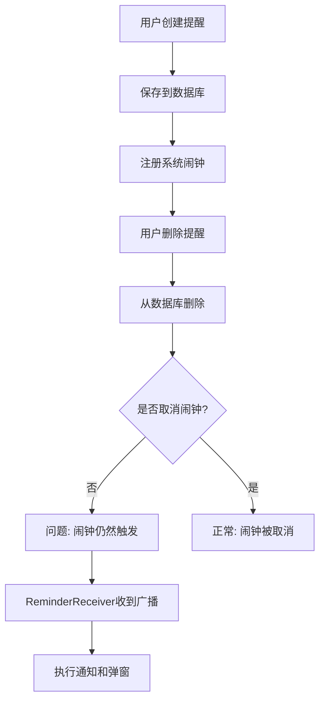
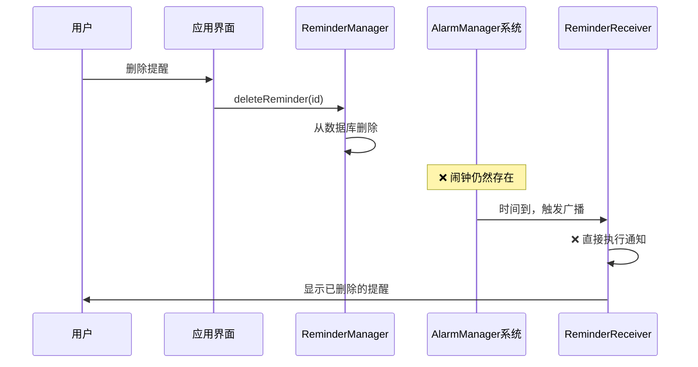
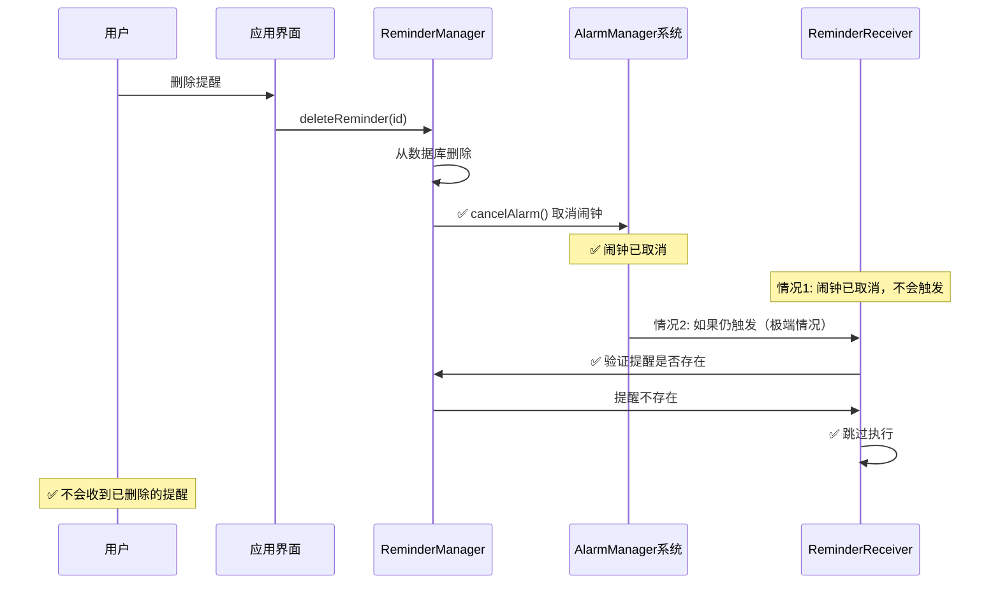

# 删除提醒仍执行通知问题修复文档

## 🚨 问题描述

**现象**: 用户删除了定时通知后，系统仍然会在预设时间执行通知并弹出提醒弹窗。

**影响**: 
- 用户体验差，已删除的提醒仍然打扰用户
- 数据不一致，界面显示已删除但系统仍执行
- 可能导致用户对应用功能的信任度下降

## 🔍 问题分析

### 1. 根本原因

Android的`AlarmManager`是系统级服务，即使应用数据删除了提醒记录，已经注册的系统闹钟仍然会在预设时间触发。

### 2. 问题流程



### 3. 缺失的环节

1. **删除提醒时未取消闹钟**: `ReminderManager.deleteReminder()` 方法缺少 `cancelAlarm()` 调用
2. **缺少二次验证**: `ReminderReceiver` 没有验证提醒是否仍然有效

## 🛠️ 解决方案

### 1. 修复删除逻辑 - 在删除时取消闹钟

**文件**: `app/src/main/java/com/example/fourquadrant/ReminderManager.java`

**修复前**:
```java
public void deleteReminder(String reminderId) {
    ReminderItem deletedReminder = null;
    for (int i = 0; i < reminders.size(); i++) {
        if (reminders.get(i).getId().equals(reminderId)) {
            deletedReminder = reminders.remove(i);
            break;
        }
    }
    if (deletedReminder != null) {
        saveReminders();
        notifyReminderDeleted(deletedReminder);
        notifyRemindersChanged();
    }
}
```

**修复后**:
```java
public void deleteReminder(String reminderId) {
    ReminderItem deletedReminder = null;
    for (int i = 0; i < reminders.size(); i++) {
        if (reminders.get(i).getId().equals(reminderId)) {
            deletedReminder = reminders.remove(i);
            break;
        }
    }
    if (deletedReminder != null) {
        // 🔑 关键修复：删除提醒时必须取消对应的系统闹钟
        cancelAlarm(deletedReminder);
        
        saveReminders();
        notifyReminderDeleted(deletedReminder);
        notifyRemindersChanged();
        
        System.out.println("已删除提醒并取消闹钟: " + deletedReminder.getContent());
    }
}
```

### 2. 添加二次验证 - 在执行前验证提醒有效性

**文件**: `app/src/main/java/com/example/fourquadrant/ReminderReceiver.java`

**修复前**:
```java
@Override
public void onReceive(Context context, Intent intent) {
    Log.d(TAG, "收到提醒广播");
    
    // 直接执行提醒，没有验证
    String reminderId = intent.getStringExtra("reminder_id");
    String content = intent.getStringExtra("reminder_content");
    // ... 执行通知
}
```

**修复后**:
```java
@Override
public void onReceive(Context context, Intent intent) {
    Log.d(TAG, "收到提醒广播");
    
    String reminderId = intent.getStringExtra("reminder_id");
    String content = intent.getStringExtra("reminder_content");
    boolean isVibrate = intent.getBooleanExtra("reminder_vibrate", true);
    boolean isSound = intent.getBooleanExtra("reminder_sound", true);
    boolean isRepeat = intent.getBooleanExtra("reminder_repeat", false);
    
    // 🔑 关键修复：验证提醒是否仍然存在且激活
    if (!isReminderStillValid(context, reminderId)) {
        Log.d(TAG, "提醒已被删除或未激活，跳过执行: " + reminderId);
        return; // 提醒已被删除，不执行任何操作
    }
    
    Log.d(TAG, "执行提醒: " + content);
    
    // 执行通知逻辑...
}
```

### 3. 实现验证方法

```java
/**
 * 验证提醒是否仍然存在且激活
 * @param context 上下文
 * @param reminderId 提醒ID
 * @return true表示提醒有效，false表示提醒已被删除或未激活
 */
private boolean isReminderStillValid(Context context, String reminderId) {
    try {
        // 使用ReminderManager验证提醒状态
        ReminderManager reminderManager = new ReminderManager(context);
        ReminderItem reminder = reminderManager.getReminderById(reminderId);
        
        if (reminder == null) {
            Log.d(TAG, "提醒不存在: " + reminderId);
            return false; // 提醒不存在
        }
        
        if (!reminder.isActive()) {
            Log.d(TAG, "提醒未激活: " + reminderId);
            return false; // 提醒未激活
        }
        
        Log.d(TAG, "提醒有效: " + reminderId);
        return true; // 提醒存在且激活
        
    } catch (Exception e) {
        Log.e(TAG, "验证提醒状态失败: " + reminderId, e);
        return false; // 异常情况下不执行提醒
    }
}
```

## 📊 修复效果对比

### 修复前的问题流程



### 修复后的正确流程



## 🔧 技术实现细节

### 1. AlarmManager 闹钟取消机制

```java
public void cancelAlarm(ReminderItem reminder) {
    AlarmManager alarmManager = (AlarmManager) context.getSystemService(Context.ALARM_SERVICE);
    
    Intent intent = new Intent(context, ReminderReceiver.class);
    PendingIntent pendingIntent = PendingIntent.getBroadcast(
        context,
        reminder.getId().hashCode(), // 🔑 关键：使用相同的requestCode
        intent,
        PendingIntent.FLAG_UPDATE_CURRENT | PendingIntent.FLAG_IMMUTABLE
    );
    
    if (alarmManager != null) {
        alarmManager.cancel(pendingIntent); // 取消闹钟
    }
}
```

**要点**:
- 必须使用与设置闹钟时相同的 `requestCode` (即 `reminder.getId().hashCode()`)
- 必须使用相同的 `Intent` 和 `PendingIntent` 参数
- 使用 `FLAG_UPDATE_CURRENT` 确保找到正确的 PendingIntent

### 2. 防御性编程 - 双重保险

即使闹钟取消机制偶尔失效，二次验证机制也能确保不执行已删除的提醒：

```java
// 第一层保险：删除时取消闹钟
cancelAlarm(deletedReminder);

// 第二层保险：执行前验证有效性  
if (!isReminderStillValid(context, reminderId)) {
    return; // 跳过执行
}
```

### 3. 日志和调试支持

添加了详细的调试日志：

```java
// 删除时的日志
System.out.println("已删除提醒并取消闹钟: " + deletedReminder.getContent());

// 验证时的日志
Log.d(TAG, "提醒已被删除或未激活，跳过执行: " + reminderId);
Log.d(TAG, "执行提醒: " + content);
```

便于跟踪问题和验证修复效果。

## 🎯 验证和测试

### 1. 测试场景

#### 场景1：正常删除测试
1. 创建一个5分钟后的提醒
2. 立即删除该提醒
3. 等待5分钟
4. **预期结果**: 不应该收到任何通知

#### 场景2：删除后重启应用测试
1. 创建提醒
2. 删除提醒
3. 关闭并重启应用
4. 等待提醒时间
5. **预期结果**: 不应该收到任何通知

#### 场景3：批量删除测试
1. 创建多个提醒（不同时间）
2. 删除其中几个
3. 等待所有提醒时间
4. **预期结果**: 只有未删除的提醒执行

### 2. 日志验证

查看Logcat输出，正常情况下应该看到：

```
ReminderManager: 已删除提醒并取消闹钟: [提醒内容]
ReminderReceiver: 提醒已被删除或未激活，跳过执行: [提醒ID]
```

### 3. 异常情况处理

修复方案还考虑了各种异常情况：

- **ReminderManager 初始化失败**: 返回 false，不执行提醒
- **数据读取异常**: 返回 false，不执行提醒  
- **Context 为空**: 返回 false，不执行提醒

## 📋 相关代码变更总结

### 变更的文件

1. **ReminderManager.java** 
   - 修改 `deleteReminder()` 方法
   - 添加 `cancelAlarm()` 调用和日志

2. **ReminderReceiver.java**
   - 修改 `onReceive()` 方法
   - 添加 `isReminderStillValid()` 验证方法
   - 添加详细的调试日志

### 代码行数统计

- **新增代码**: ~40行
- **修改代码**: ~10行
- **总影响**: 50行代码变更

### 向后兼容性

- ✅ 完全向后兼容
- ✅ 不影响现有功能
- ✅ 只是增强了删除逻辑的可靠性

## 🎉 修复效果

### 修复前的问题
- ❌ 删除提醒后仍然执行通知
- ❌ 用户体验差，困扰用户
- ❌ 数据不一致
- ❌ 缺少防御机制

### 修复后的改善
- ✅ 删除提醒后立即取消系统闹钟
- ✅ 双重验证机制，确保安全
- ✅ 详细日志支持调试
- ✅ 异常情况的防御性处理
- ✅ 用户体验显著改善

## 📝 总结

通过在删除提醒时正确取消系统闹钟，并在执行提醒前验证其有效性，彻底解决了删除提醒仍执行通知的问题。这个修复方案具有以下特点：

1. **双重保险机制**: 删除时取消 + 执行前验证
2. **防御性编程**: 考虑各种异常情况
3. **详细日志**: 便于问题追踪和调试
4. **向后兼容**: 不影响现有功能
5. **用户体验**: 彻底解决用户困扰

现在用户删除提醒后，可以确信不会再收到相关的通知，提供了可靠、一致的用户体验。
