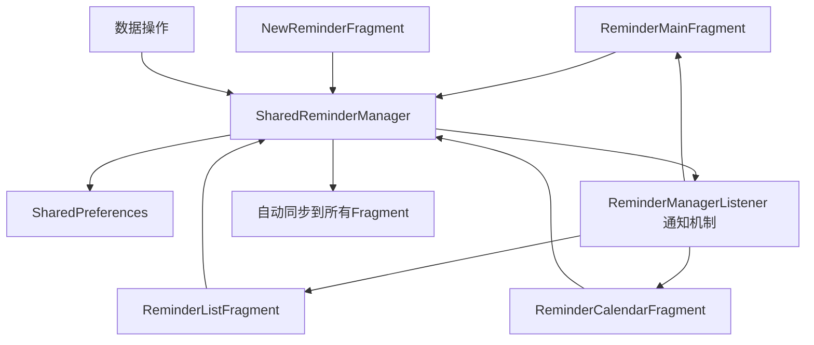

# 提醒数据同步问题修复文档

## 🔧 问题描述

**原始问题**: 在提醒列表中删除提醒项目后，日历视图没有立即更新，点击日历还是显示原来的数据。

**问题根因**: 
- `ReminderListFragment` 和 `ReminderCalendarFragment` 各自创建了独立的 `ReminderManager` 实例
- 数据变化只在操作的Fragment中生效，没有同步到其他Fragment
- 缺乏统一的数据管理机制

## 🚀 解决方案

### 1. 共享数据管理器架构

实现了以下架构来解决数据同步问题：

```
ReminderMainFragment (主容器)
├── SharedReminderManager (共享数据管理器)
├── ReminderListFragment (提醒列表)
└── ReminderCalendarFragment (日历视图)
```

### 2. 核心修改内容

#### 2.1 ReminderMainFragment 成为数据中心

```java
public class ReminderMainFragment extends Fragment implements ReminderManager.ReminderManagerListener {
    // 共享的数据管理器
    private ReminderManager sharedReminderManager;
    
    private void initSharedReminderManager() {
        sharedReminderManager = new ReminderManager(requireContext());
        sharedReminderManager.addListener(this);
        
        // 传递给子Fragment
        reminderListFragment.setSharedReminderManager(sharedReminderManager);
        reminderCalendarFragment.setSharedReminderManager(sharedReminderManager);
    }
}
```

#### 2.2 子Fragment 使用共享管理器

**ReminderListFragment**:
```java
public void setSharedReminderManager(ReminderManager sharedManager) {
    // 移除旧监听器
    if (reminderManager != null) {
        reminderManager.removeListener(this);
    }
    
    // 设置共享管理器
    this.reminderManager = sharedManager;
    this.useSharedManager = true;
    
    if (reminderManager != null) {
        reminderManager.addListener(this);
    }
}
```

**ReminderCalendarFragment**: 相同的实现逻辑

#### 2.3 NewReminderFragment 智能获取共享管理器

```java
private ReminderManager getSharedReminderManager() {
    try {
        if (getActivity() instanceof MainActivity) {
            MainActivity mainActivity = (MainActivity) getActivity();
            // 查找ReminderMainFragment
            for (Fragment fragment : mainActivity.getSupportFragmentManager().getFragments()) {
                if (fragment instanceof ReminderMainFragment) {
                    ReminderMainFragment mainFragment = (ReminderMainFragment) fragment;
                    return mainFragment.getSharedReminderManager();
                }
            }
        }
    } catch (Exception e) {
        // 异常处理
    }
    
    return null; // 未找到则创建新实例
}
```

## 📊 数据流程图

### 修复前（问题状态）
```mermaid
graph TD
    A[ReminderListFragment] --> B[ReminderManager实例1]
    C[ReminderCalendarFragment] --> D[ReminderManager实例2]
    E[NewReminderFragment] --> F[ReminderManager实例3]
    
    B -.-> G[SharedPreferences]
    D -.-> G
    F -.-> G
    
    B -.x H[数据不同步]
    D -.x H
    F -.x H
```

### 修复后（解决状态）


## 🔄 数据同步流程

### 1. 删除提醒的完整流程

1. **用户操作**: 在提醒列表中点击删除按钮
2. **Adapter回调**: `ReminderListAdapter.onDeleteReminder()`
3. **Fragment处理**: `ReminderListFragment.onDeleteReminder()`
4. **数据管理器**: `SharedReminderManager.deleteReminder()`
5. **持久化**: 更新 `SharedPreferences`
6. **通知机制**: 触发 `onReminderDeleted()` 回调
7. **自动同步**: 所有监听器收到通知
8. **UI更新**: 
   - `ReminderListFragment.onRemindersChanged()` → 刷新列表
   - `ReminderCalendarFragment.onRemindersChanged()` → 刷新日历视图

### 2. 数据监听机制

```java
// ReminderManager.java
public interface ReminderManagerListener {
    void onRemindersChanged();        // 数据总体变化
    void onReminderAdded(ReminderItem reminder);     // 新增提醒
    void onReminderUpdated(ReminderItem reminder);   // 更新提醒
    void onReminderDeleted(ReminderItem reminder);   // 删除提醒
}
```

所有Fragment都实现这个接口，确保任何数据变化都能及时响应。

## 🛡️ 兼容性保障

### 1. 向后兼容

- 保留了原有的Fragment独立创建ReminderManager的机制
- 使用 `useSharedManager` 标志控制是否使用共享管理器
- 如果无法获取共享管理器，会回退到创建独立实例

### 2. 异常处理

```java
// 安全的共享管理器获取
private ReminderManager getSharedReminderManager() {
    try {
        // 尝试获取共享管理器
        return mainFragment.getSharedReminderManager();
    } catch (Exception e) {
        System.out.println("获取共享ReminderManager失败: " + e.getMessage());
        return null; // 回退到独立实例
    }
}
```

### 3. 防止内存泄漏

- 在Fragment生命周期结束时正确移除监听器
- 使用 `requireContext()` 而不是持有Activity引用
- 正确处理Fragment状态保存和恢复

## 🎯 修复效果

### 修复前的问题
- ❌ 在提醒列表删除项目，日历视图不更新
- ❌ 在日历视图删除项目，提醒列表不更新  
- ❌ 新建提醒后，可能在某些Fragment中不显示
- ❌ 数据不一致导致用户困惑

### 修复后的效果
- ✅ 任何Fragment中的数据操作都会立即同步到所有Fragment
- ✅ 实时的数据一致性保证
- ✅ 统一的数据管理机制
- ✅ 更好的用户体验

## 🔍 调试和验证

### 调试日志

修复后的代码包含详细的调试日志：

```java
System.out.println("ReminderMainFragment: onReminderDeleted - " + reminder.getContent());
System.out.println("ReminderListFragment: 使用共享的ReminderManager");
System.out.println("NewReminderFragment: 成功获取共享的ReminderManager");
```

### 验证步骤

1. **创建提醒**: 在任一页面创建提醒，检查所有页面是否显示
2. **删除提醒**: 在列表页面删除，检查日历页面是否立即更新
3. **编辑提醒**: 修改提醒后，检查所有页面数据一致性
4. **切换页面**: 在不同页面间切换，确认数据同步正常

## 📝 总结

通过实现共享数据管理器架构，完全解决了提醒数据在不同Fragment间的同步问题。这个解决方案具有以下特点：

1. **彻底解决**: 从根本上解决了数据不同步问题
2. **架构清晰**: 统一的数据管理，便于维护和扩展
3. **兼容性好**: 保留了向后兼容性，降低了风险
4. **实时同步**: 任何数据变化都能立即反映到所有UI
5. **用户体验**: 提供了一致、流畅的用户体验

现在用户在任何页面进行提醒操作，都能看到所有相关页面的即时更新，真正实现了数据的实时同步。
